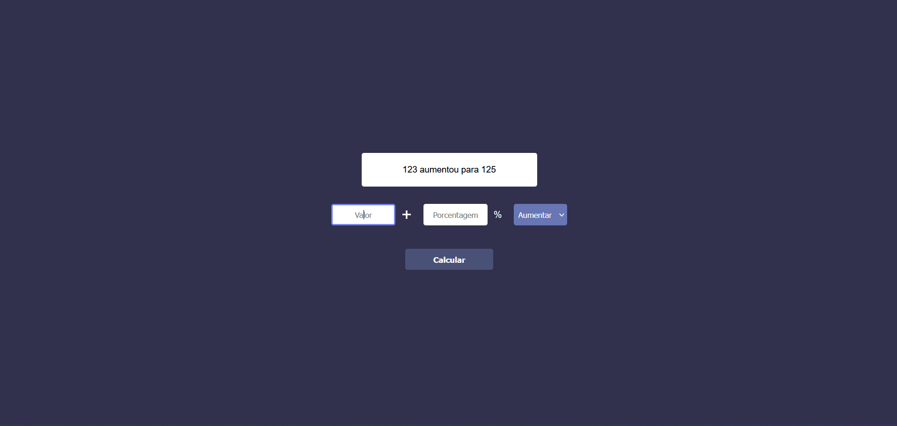

# Percentage Calculator
This project is a calculator that have as main function to calculate a percentagem over a value.

## Tecnologies
- HTML
- CSS
- Typescript
- Vite

## Screenshots

## How to use

- First you should pass decimal value.
- After you should pass percentage value.
- After you should select if it will be increase or decrease
- And finally you should click in calculate button and the calculation will be finish

Link: https://percentage-calculator-fernando.vercel.app
